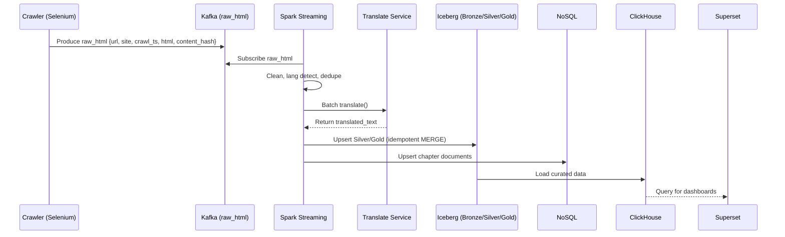

# System Architecture Document
**Project:** Novel ETL → Translation Augmentation → Feature Engineering → ML (Spark MLlib) → Analytics (Superset)  
**Architecture Style:** Lambda Architecture (Batch + Speed) on Kubernetes  
**Primary Data Plane:** HDFS Lakehouse with Apache Iceberg; Kafka event backbone  
**Control Plane:** Airflow (orchestration), DataHub (catalog/lineage), Prometheus/Grafana (monitoring)

---

## 1. Objectives & Scope

- **Objective:** Build an end-to-end **big data processing system** to crawl web novels, clean/enrich text (Google Translate), engineer features, train translation-related ML models with **Spark MLlib**, and **visualize** outcomes in Superset.  
- **Scope:**  
  - Ingestion from web sources (Selenium) with **near-real-time streaming** via Kafka and **batch backfills**.  
  - Storage in **HDFS** with **Iceberg** tables (Bronze/Silver/Gold).  
  - Processing with **PySpark** (batch & Structured Streaming) including deduplication, late data, state, joins, UDFs, and windowing.  
  - Serving analytics via **ClickHouse** (optional) and/or directly from Iceberg (via Trino/Presto) to **Superset**.  
  - Deployment on **Kubernetes** (Spark Operator, Strimzi, Helm charts).  
  - Governance (DataHub), scheduling (Airflow), monitoring (Prometheus/Grafana), and **exactly-once** semantics where required.

**Out of Scope (for now):** End-user product UI, multilingual human-in-the-loop review, deep NMT training beyond MLlib baselines.

---

## 2. High-Level Architecture

### 2.1 Context Diagram

```mermaid
flowchart LR
  subgraph Web
    A[Novel Websites]
  end

  subgraph Ingestion on k8s
    C[Selenium Crawler\n(Deployments/Jobs)]
    K[(Kafka\nraw_html, translations)]
  end

  subgraph Data Lake on k8s
    H[(HDFS)]
    I[Apache Iceberg\n(Bronze/Silver/Gold)]
  end

  subgraph Processing on k8s
    S1[PySpark Batch\n(Bronze->Silver->Gold)]
    S2[Spark Structured Streaming\n(Kafka->Iceberg/NoSQL)]
    GT[Translate Microservice\n(rate-limited)]
  end

  subgraph Serving
    N[(NoSQL)]
    CH[(ClickHouse)]
    TR[Trino/Presto]
  end

  subgraph Observability & Control
    AF[Airflow]
    DH[DataHub]
    PR[Prometheus/Grafana]
    SP[Superset]
  end

  A --> C --> K
  K --> S2
  S2 --> I
  S1 --> I
  I --> TR --> SP
  I --> CH --> SP
  S2 <---> GT
  S2 --> N
  AF --> S1
  AF --> I
  AF --> CH
  DH --- I
  DH --- K
  PR --- S1
  PR --- S2
  PR --- K
  PR --- CH
  PR --- TR
```

---

## 3. Component Architecture

### 3.1 Ingestion
**Selenium Crawler (k8s Deployments/Jobs)**  
Scrapes chapter HTML + metadata; normalizes timestamps; computes `content_hash`.  
Writes messages to **Kafka** topic `raw_html` (key=`content_hash`, value=JSON).  
Idempotent producers enabled; retry/backoff policy.

**Kafka (Strimzi Operator)**  
- Topics: `raw_html`, `translations`  
- Settings: replication ≥3, compaction for keyed updates, retention 7–30 days.

### 3.2 Processing (Spark)
**Structured Streaming (Speed Layer)**  
Reads Kafka → cleans, dedupes, detects language, and calls Translate API (via microservice).  
Writes to Iceberg (Silver/Gold) and NoSQL with exactly-once semantics.  

**Batch ETL (Bronze→Silver→Gold)**  
Performs large-scale reprocessing, window functions, pivot/unpivot, AQE optimizations.  

**Translate Microservice**  
Rate-limited interface to Google Translate API with retries and DLQ handling.

### 3.3 Storage & Serving
**HDFS + Iceberg**: Main data lake (Bronze, Silver, Gold).  
**NoSQL (MongoDB/Cassandra)**: Low-latency access for chapters/features.  
**ClickHouse**: Fast OLAP queries for Superset dashboards.  
**Superset**: Visualization and analytics interface.

---

## 4. Detailed Data Flow



---

## 5. Spark Features & Optimizations

- Window functions, pivot/unpivot, and UDAFs  
- Broadcast joins, sort-merge joins, AQE  
- Partition pruning, bucketing, caching strategies  
- Structured Streaming with watermarking and stateful deduplication  
- Exactly-once semantics with idempotent Iceberg merges  

---

## 6. Machine Learning (Spark MLlib)

Trains translation-quality models using engineered features.  
Pipelines: TF-IDF, n-grams, language confidence, novelty features.  
Outputs models stored in Iceberg (versioned).  

---

## 7. Deployment on Kubernetes

All components (Spark, Kafka, Airflow, Superset, DataHub, HDFS) are containerized and deployed via Helm or Operators.  
Secrets and configs are managed via Kubernetes Secrets/ConfigMaps.  
Autoscaling for Spark executors and Kafka brokers enabled.

---

## 8. Monitoring, Governance, and DQ

- **Airflow** for orchestration and compaction.  
- **DataHub** for lineage and schema management.  
- **Prometheus/Grafana** for metrics.  
- **Great Expectations** for data quality.  

---

## 9. Security

- Kafka SASL/SCRAM, Superset SSO, Iceberg ACLs.  
- HDFS encryption zones, TLS in-transit.  
- Role-based dashboards and data access.

---

## 10. Non-Functional Requirements

- Throughput ≥ X chapters/min  
- Stream latency ≤ Y min  
- 99.5% uptime for ingestion/analytics  
- Cost-optimized scaling (autosuspend batch pools)  

---

## 11. Key Advantages

- Unified batch and streaming processing (Lambda).  
- Exactly-once Spark streaming with Iceberg.  
- Full governance (DataHub) and orchestration (Airflow).  
- Cloud-native, production-ready on Kubernetes.  

---

**End of Document**
